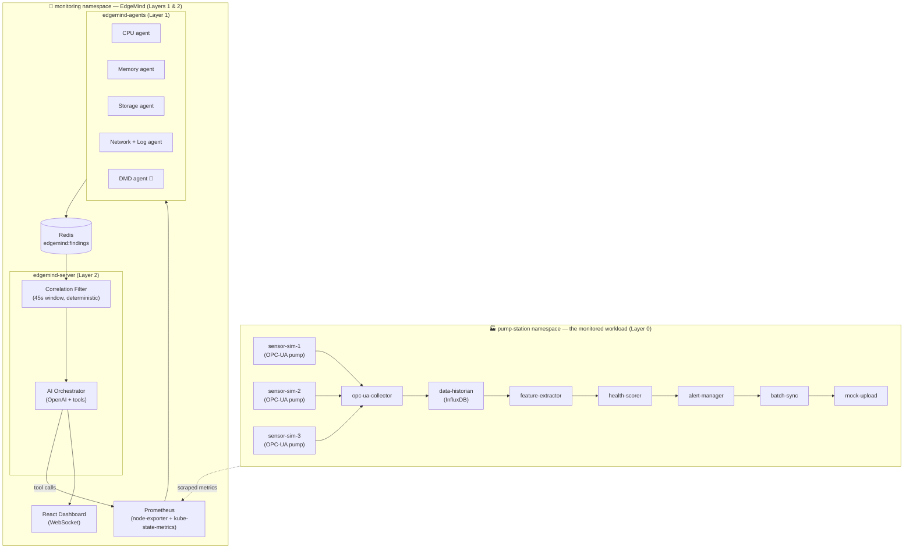
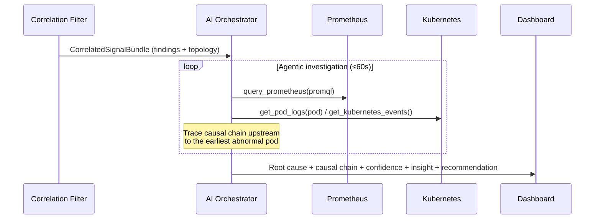
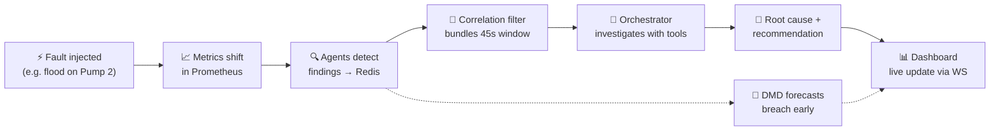

<div align="center">


# EdgeMind

### Multi-Agent AI for Industrial Pod-Resource Correlation
**Predictive condition monitoring for Kubernetes-based pump stations on ABB Edgenius**

[](https://k3d.io)
[](https://fastapi.tiangolo.com)
[](https://react.dev)
[](https://platform.openai.com)
[](https://prometheus.io)
[](#-testing)

*Detect. Correlate. Explain. Forecast — before the failure reaches the field.*

### 📊 [**View the Presentation →**](http://canva.link/edgemind)

</div>

---

> **EdgeMind watches an entire industrial pipeline from the outside** — using only standard infrastructure metrics (CPU, memory, network, disk, PVC) scraped from Prometheus. Five specialized AI agents detect anomalies, a deterministic correlation engine bundles related signals, and an LLM orchestrator traces them back to a single **root cause** with a plain-English explanation a field engineer can act on. A Dynamic Mode Decomposition (DMD) agent forecasts resource failures *before they happen.*
>
> **Zero workload modification. Zero custom instrumentation. Zero sidecars.**

<div align="center">

<!-- 📸 SCREENSHOT: Command Center dashboard (full page). Save as docs/screenshots/command-center.png -->


<sub>EdgeMind Command Center — live cluster health, active incidents, and AI root-cause analysis</sub>

</div>

---

## 📑 Table of Contents

- [The Problem](#-the-problem)
- [The Solution](#-the-solution)
- [Key Features](#-key-features)
- [System Architecture](#-system-architecture)
- [Layer 0 — The Pump-Station Pipeline](#-layer-0--the-pump-station-pipeline)
- [Layer 1 — Detection Agents](#-layer-1--detection-agents)
- [Layer 2 — AI Correlation & Orchestration](#-layer-2--ai-correlation--orchestration)
- [DMD Early Warning](#-dmd-early-warning-the-differentiator)
- [The Dashboard](#-the-dashboard)
- [End-to-End Workflow](#-end-to-end-workflow)
- [Finding Schema](#-finding-schema)
- [Tech Stack](#-tech-stack)
- [Repository Structure](#-repository-structure)
- [Getting Started](#-getting-started)
- [Fault Injection & Demo Scenarios](#-fault-injection--demo-scenarios)
- [API Reference](#-api-reference)
- [Testing](#-testing)
- [Roadmap](#-roadmap)

---

## The Problem

In an industrial edge deployment, a single pump-station failure rarely stays contained. A bearing fault on one sensor cascades: the data collector spikes, the historian gets overloaded, the feature pipeline starves for CPU, and downstream export services contend for the same disk. By the time an operator sees a dozen red alerts, the real question — **"which one started it?"** — is buried under noise.

Traditional monitoring tells you *what* is on fire. It does not tell you *why*, *in what order*, or *what's about to break next*.

## The Solution

EdgeMind adds three layers of intelligence on top of a running Kubernetes workload:

| | Layer | What it does |
|---|---|---|
| 🟦 | **Detection** | 5 domain agents read Prometheus metrics and emit structured *findings* with evidence, baselines, and ETAs |
| 🟨 | **Correlation** | A deterministic 45-second window engine bundles related findings across agents — no LLM, fully reproducible |
| 🟪 | **Reasoning** | An OpenAI orchestrator uses live tools (PromQL, pod logs, K8s events) to trace the causal chain to a single root cause |

The result is delivered to a real-time React command center: **one incident, one root cause, one recommendation** — plus a forecast of what's coming.

---

## ✨ Key Features

- 🧠 **Multi-agent anomaly detection** — CPU, Memory, Storage, Network/Log, and DMD agents, each an independent specialist
- 🔗 **Deterministic correlation** — reproducible 45s windowing groups multi-agent signals before any AI is involved
- 🤖 **LLM root-cause orchestration** — tool-calling agent that queries Prometheus, reads pod logs, and inspects K8s events to reason from evidence (not assumptions)
- 🔮 **DMD predictive early warning** — Dynamic Mode Decomposition forecasts resource breaches *minutes before* they occur
- 📊 **6-page operations dashboard** — command center, resource radar, dependency graph, anomaly timeline, AI investigation, and a live demo lab
- 💬 **Industrial Copilot** — chat with live telemetry and incident context
- 🧪 **Built-in fault injection** — 7 physical fault modes + 4 scripted cascade scenarios for repeatable demos
- 🩺 **Infra-only & non-invasive** — no SDK changes, no sidecars, watches any workload from the outside
- ✅ **Fully tested** — agents and pipeline services run their unit suites without a cluster

---

## 🏗 System Architecture

EdgeMind is a three-layer system running across two Kubernetes namespaces.



**The golden rule:** EdgeMind agents talk to **Prometheus only**. They never connect to InfluxDB, the OPC-UA bus, or any workload API. This makes EdgeMind portable to *any* Kubernetes workload — the pump station is just the demonstration target.

---

## 🟦 Layer 0 — The Pump-Station Pipeline

A realistic 10-service industrial data pipeline: three OPC-UA pump simulators feed a collect → store → analyze → score → alert → export chain. Every service exposes a fault-injection or behavior API so cascades can be triggered on demand.

| Component | Role | Tech |
|---|---|---|
| **sensor-sim-1/2/3** | OPC-UA pump simulators with physical fault-injection API | asyncua, FastAPI |
| **opc-ua-collector** | Subscribes to OPC-UA tags, writes to the historian | asyncua, influxdb-client |
| **data-historian** | Time-series store | InfluxDB 2.x |
| **feature-extractor** | Computes bearing health, vibration & temperature trends | scipy, numpy |
| **health-scorer** | Classifies pump state → HEALTHY / WARNING / CRITICAL | pure Python |
| **alert-manager** | Enriches, deduplicates, writes alert JSONL to shared PVC | FastAPI |
| **batch-sync** | Bulk Parquet export to PVC, simulates cloud upload | pandas, pyarrow |
| **mock-upload** | Simulated cloud upload endpoint | FastAPI |

---

## 🟨 Layer 1 — Detection Agents

Five agents poll Prometheus every **15 seconds**, maintain rolling statistical baselines, and publish structured findings to Redis. Each is a focused specialist.

### 🔴 CPU Agent
`cpu_spike` · `cpu_throttle` · `cpu_contention`
Absolute + relative gating over a rolling window (z-score used only for *severity grading*, not the trigger — idle pods produce huge z-scores on trivial bumps). Requires sustained breach across multiple cycles to suppress single-scrape noise. Flags node-level contention when multiple pods spike together.

### 🟢 Memory Agent
`memory_leak` · `pre_oom` · `oomkill_detected` · `node_memory_pressure` · `memory_step_change`
Linear regression over the RSS window computes a leak slope in MB/min. `pre_oom` projects an **ETA to OOM** at the current growth rate. OOMKills are confirmed against pre-restart working-set/limit ratios.

### 🟠 Storage Agent
`io_saturation` · `write_burst` · `pvc_fill` · `pvc_contention` · `restart_linked_to_io`
Z-score on write-rate for burst detection; linear regression on PVC `used_bytes` for **time-to-full** forecasting. PVC→pod mapping is built live from the Kubernetes API. Contention fires when ≥2 high-I/O pods share one PVC.

### 🔵 Network + Log Agent
`network_flood` · `packet_drop` · `dependency_confirmed` · `log_error_surge` · `timeout_pattern` · `pump_health_critical` · `crash_loop` · `k8s_oomkill`
P75 baseline flood detection; cross-pod dependency confirmation (TX spike on A correlated with RX spike on B within a lag window). Parses health-scorer structured logs for pump-level fault signatures and watches Kubernetes events for `CrashLoopBackOff` / `OOMKilling` / `BackOff`.

### 🔮 DMD Agent — *Predictive Early Warning*
`dmd_cpu_forecast` · `dmd_mem_forecast` · `dmd_io_forecast` · `dmd_net_forecast` · `dmd_instability`
Forecasts resource breaches *before* they occur using Dynamic Mode Decomposition. [See below ↓](#-dmd-early-warning-the-differentiator)

---

## 🟪 Layer 2 — AI Correlation & Orchestration

### Deterministic Correlation Filter
Before any AI runs, a pure-Python engine ([`correlation_filter.py`](edgemind_server/correlation_filter.py)) reads findings from Redis and groups them into **45-second windows**, deduplicating by `(anomaly_type, pod)`. It triggers the orchestrator on one of three conditions:

| Trigger | Condition |
|---|---|
| `multi_agent` | 2+ findings from **different** agents in the window |
| `single_critical` | one CRITICAL finding of a high-confidence type (OOMKill, memory leak, PVC fill, I/O saturation) |
| `single_agent_significant` | a self-sufficient signal (e.g. `pump_health_critical`) — deferred until window close so all evidence accumulates |

A **10-minute cooldown** prevents alert storms. Relative-threshold detectors (`cpu_spike`, `network_flood`) deliberately require corroboration to fire — eliminating the near-idle false-positive class.

### LLM Orchestrator
When triggered, the orchestrator ([`orchestrator.py`](edgemind_server/orchestrator.py)) runs an agentic tool-calling loop against an OpenAI-compatible model. It is given the pipeline topology and the correlated bundle, then **investigates with live tools**:



The orchestrator is constrained to **reason from observed evidence only** — it must cite real metrics/log lines or explicitly state "no errors found," and lower its confidence when evidence is inconclusive. Output is a structured verdict:

```json
{
  "root_cause_pod": "sensor-sim-2",
  "causal_chain": ["sensor-sim-2", "opc-ua-collector", "data-historian"],
  "alert_type": "cascade",
  "confidence": 0.92,
  "insight": "The Pump 2 sensor switched to flood mode, overwhelming the data collection service...",
  "recommendation": "Throttle sensor-sim-2 emission rate or scale the collector."
}
```

**Confidence scoring** — `≥0.9` multi-agent agreement + topological ordering · `0.7–0.9` two agents agree · `0.5–0.7` single/ambiguous · `<0.5` flagged for manual investigation.

---

## 🔮 DMD Early Warning — *The Differentiator*

Most monitoring is **reactive**: it fires when a threshold is already crossed. EdgeMind's DMD agent is **predictive**.

[Dynamic Mode Decomposition](https://en.wikipedia.org/wiki/Dynamic_mode_decomposition) (Schmid 2010) is a technique from fluid dynamics that decomposes a multivariate time series into spatial-temporal *modes*, each with a growth/decay rate. EdgeMind applies **Exact DMD** ([`dmd_core.py`](edgemind_agents/dmd_core.py)) to live resource metrics:

1. Build a snapshot matrix of recent metric history
2. Thin/truncated **SVD** → reduced linear operator `Ã`
3. **Eigendecomposition** → eigenvalues `λ` and DMD modes `Φ`
4. Convert each eigenvalue to a continuous **growth rate** `σ = log|λ| / dt`
5. A **positive dominant growth rate** means a metric is on an exponential climb toward its limit → emit a forecast finding **before the breach**

This means EdgeMind can warn *"feature-extractor memory is trending to OOM in ~6 minutes"* while the value is still nominal — turning a 2am page into a planned intervention.

<div align="center">

<!-- 📸 SCREENSHOT: DMD forecast chart / DMD Warning Panel. Save as docs/screenshots/dmd-forecast.png -->


<sub>DMD projecting a resource trajectory past its limit ahead of the actual breach</sub>

</div>

---

## 📊 The Dashboard

A real-time React 18 single-page app, fed by a FastAPI WebSocket. Six purpose-built views:

| Route | Page | Purpose |
|---|---|---|
| `/` | **Command Center** | Live ops overview — cluster vitals, active incidents, pump digital twins, top risky pods, forecast strip |
| `/radar` | **Resource Radar** | Per-pod deep dive — CPU/mem/IO charts, app-specific panels, a 3D pump scene, fault injection controls |
| `/graph` | **Correlation Map** | Interactive dependency graph with live node health and animated causal-path overlay |
| `/timeline` | **Anomaly Timeline** | Scrollable event timeline with correlation brackets linking findings to incidents |
| `/investigate` | **AI Investigation** | Full orchestrator output — causal chain steps, evidence matrix, "why-not" reasoning, confidence tiers |
| `/demo` | **Demo Lab** | One-click scenario launcher + manual fault controls + live cascade monitor |

Plus a floating **EdgeMind Copilot** chat that answers questions against live telemetry, findings, and alerts.

<div align="center">

<!-- 📸 SCREENSHOT GALLERY — capture these four and save under docs/screenshots/ -->
<table>
  <tr>
    <td><br/><sub>Correlation Map — live dependency graph</sub></td>
    <td><br/><sub>AI Investigation — root cause & evidence</sub></td>
  </tr>
  <tr>
    <td><br/><sub>Anomaly Timeline — correlated events</sub></td>
    <td><br/><sub>Demo Lab — scenario launcher</sub></td>
  </tr>
</table>

</div>

---

## 🔄 End-to-End Workflow



**A typical cascade, start to finish:**
1. Operator injects `flood` on sensor-sim-2 (10× emission rate)
2. Network/Log agent detects `network_flood`; CPU agent detects `cpu_spike` on the collector
3. Two different agents in one 45s window → `multi_agent` trigger
4. Orchestrator queries Prometheus, reads collector logs, traces upstream to the sensor
5. Verdict: **root cause = sensor-sim-2, cascade, 92% confidence** — pushed to every dashboard in real time

---

## 📦 Finding Schema

Every finding published to Redis is a self-describing evidence package:

```json
{
  "finding_id": "uuid",
  "timestamp": "2026-06-13T15:54:44+00:00",
  "agent": "cpu | memory | storage | network_log | dmd",
  "anomaly_type": "cpu_spike",
  "severity": "warning | critical | info",
  "pod": "opc-ua-collector",
  "namespace": "pump-station",
  "current_value": 0.82,
  "baseline_value": 0.05,
  "deviation": "Z-score 4.2σ above 75-cycle baseline",
  "evidence": ["cpu rose 0.011 → 0.0225 cores over 3 cycles", "..."],
  "affected_pods": [],
  "pvc_name": null,
  "eta_minutes": null
}
```

---

## 🛠 Tech Stack

| Domain | Technologies |
|---|---|
| **Orchestration** | Kubernetes (k3s / k3d), Helm |
| **Backend** | Python, FastAPI, Uvicorn, asyncio |
| **AI / ML** | OpenAI (tool-calling orchestrator), NumPy + SciPy (DMD, regression, z-score) |
| **Messaging / State** | Redis (async), WebSockets |
| **Observability** | Prometheus, node-exporter, kube-state-metrics |
| **Data pipeline** | OPC-UA (asyncua), InfluxDB 2.x, pandas, pyarrow |
| **Frontend** | React 18, Vite, React Router, Recharts, D3, Three.js / React-Three-Fiber |
| **Testing** | pytest |

---

## 🗂 Repository Structure

```
k8s-Pod-Resource-AI-Driven-Correlation/
├── k8s/                      ← Kubernetes manifests
│   ├── pump-station/         ← 10 service manifests + PVC / secrets / quota
│   └── monitoring/           ← Prometheus, Redis, edgemind-agents, server, RBAC
├── edgemind_agents/          ← Layer 1: detection agents
│   ├── agents/               ← cpu, memory, storage, network_log, dmd, base
│   ├── dmd_core.py           ← Exact DMD math engine (SVD + eig)
│   ├── anomaly_types.py      ← all anomaly types, thresholds, config
│   └── collector.py          ← Prometheus scrape loop
├── edgemind_server/          ← Layer 2: correlation + AI + API
│   ├── correlation_filter.py ← deterministic 45s windowing
│   ├── orchestrator.py       ← OpenAI tool-calling root-cause engine
│   ├── dependency_graph.py   ← live topology for prompts & UI
│   ├── tools.py              ← query_prometheus / get_pod_logs / get_kubernetes_events
│   └── main.py               ← FastAPI app + WebSocket
├── edgemind-dashboard/       ← React 18 + Vite frontend (6 pages)
├── sensor_sim/               ← OPC-UA pump simulators (Layer 0)
├── opc_ua_collector/         ← OPC-UA → InfluxDB
├── feature_extractor/        ← InfluxDB → pump features
├── health_scorer/            ← features → pump health state
├── alert_manager/            ← health state → enriched alerts
├── batch_sync/  · mock_upload/  ← export & simulated cloud upload
├── common/                   ← shared contract (schema, constants)
├── deploy.sh                 ← one-command cluster deploy
├── docker-compose.yml        ← local (non-k8s) bring-up
└── SETUP.md                  ← deployment & operations guide
```

---

## 🚀 Getting Started

### Prerequisites
`docker` · `k3d` · `kubectl` · `helm`

### One-command deploy (k3d)

```bash
# Build all images, create the cluster, and deploy both namespaces
bash deploy.sh

# Already built images? Skip the build step
bash deploy.sh --skip-build
```

The script provisions the `edgemind` k3d cluster, installs Prometheus + Redis, and rolls out the pump-station pipeline, detection agents, server, and dashboard. See **[SETUP.md](SETUP.md)** for detailed operations, port-forwarding, and troubleshooting.

### Access the dashboard

```bash
bash start-port-forwards.sh   # forwards dashboard, server, and sensor-sim APIs
# then open the dashboard URL printed by the script
```

### Local development (Docker Compose)

```bash
docker-compose up   # brings up the pipeline + agents + Redis without Kubernetes
```

> **Note:** the AI orchestrator needs an `LLM_API_KEY` (OpenAI-compatible). Set it as a Kubernetes secret (`llm-credentials`) or an env var — `LLM_BASE_URL` and `LLM_MODEL` are configurable. Detection, correlation, and DMD all run **without** a key; only the root-cause narrative requires the LLM.

---

## 🧪 Fault Injection & Demo Scenarios

Each sensor-sim exposes an HTTP injection API with **7 physical fault modes**:

| Mode | Physical meaning |
|---|---|
| `bearing_fault` | Bearing degradation — axial vibration + bearing-health drop |
| `imbalance` | Rotational imbalance — radial + tangential vibration |
| `seal_leak` | Seal degradation — gradual temperature rise |
| `cavitation` | Fluid cavitation — broadband vibration spike (sustained) |
| `overheat` | Thermal fault — temperature ramp past safe threshold |
| `flood` | Emission rate 1 Hz → 10 Hz, triggering a network/CPU cascade |
| `sensor_noise` | Random noise across all readings |

```bash
# Inject a bearing fault on Pump 2 for 300 seconds
kubectl exec -n pump-station \
  $(kubectl get pod -n pump-station -l app=sensor-sim-2 -o jsonpath='{.items[0].metadata.name}') \
  -- curl -s -X POST http://localhost:8081/inject \
  -H 'Content-Type: application/json' \
  -d '{"mode":"bearing_fault","duration_s":300}'
```

### Scripted cascade scenarios (Demo Lab, one click each)

| # | Scenario | Trigger | What EdgeMind shows |
|---|---|---|---|
| 1 | **Network Flood Cascade** | flood on sensor-sim-2 | `network_flood` + `cpu_spike` → multi-agent cascade verdict |
| 2 | **Memory Leak (Feature Extractor)** | LEAK_MODE | `memory_leak` → `pre_oom` ETA → DMD memory forecast |
| 3 | **PVC Fill (Export Data)** | continuous alert writes | `pvc_fill` + `write_burst` → time-to-full forecast |
| 4 | **Bearing Fault → Health Drop** | bearing_fault on sensor-sim-2 | `pump_health_critical` propagated to health-scorer |

---

## 🔌 API Reference

The server ([`edgemind_server/main.py`](edgemind_server/main.py)) exposes:

| Method | Endpoint | Returns |
|---|---|---|
| `GET` | `/health` | liveness |
| `GET` | `/api/alerts` | correlated AI incidents |
| `GET` | `/api/findings` | raw agent findings |
| `GET` | `/api/dependency-graph` · `/api/graph` | live pipeline topology |
| `GET` | `/api/metrics` | per-pod telemetry snapshot |
| `GET` | `/api/agent-status` | agent heartbeats |
| `GET` | `/api/dmd-forecasts` | DMD early-warning findings |
| `DELETE` | `/api/alerts` | clear incidents (resets correlation cooldown) |
| `POST` | `/api/chat` | Copilot query against live context |
| `WS` | `/ws` | real-time push of findings, alerts, metrics |

---

## ✅ Testing

```bash
# Detection agents — all mocked, no cluster needed
pytest edgemind_agents/tests/ -v        # CPU, Memory, Storage, Network/Log, Schema

# Pipeline services
pytest sensor_sim/tests/ -v             # fault engine, OPC-UA server, inject API
pytest feature_extractor/tests/ -v      # feature math
pytest health_scorer/tests/ -v          # scoring logic
pytest alert_manager/tests/ -v          # enrichment + dedup
pytest batch_sync/tests/ -v             # export state, parquet round-trip
```

---

## 🗺 Roadmap

| Status | Item |
|---|---|
| ✅ | Layer 0 — 10-service pump-station pipeline with fault injection |
| ✅ | Layer 1 — 5 detection agents (CPU, Memory, Storage, Network/Log, DMD) |
| ✅ | Layer 2 — deterministic correlation + LLM orchestrator |
| ✅ | DMD predictive early warning |
| ✅ | 6-page real-time dashboard + Copilot |
| 🔲 | Auto-remediation actions (close the loop from diagnosis to fix) |
| 🔲 | Historical incident replay & post-mortem export |
| 🔲 | Multi-cluster federation |

---

<div align="center">

### 📸 Screenshots referenced above
Capture these and drop them in `docs/screenshots/` to complete the README:
`command-center.png` · `correlation-map.png` · `ai-investigation.png` · `anomaly-timeline.png` · `demo-lab.png` · `dmd-forecast.png`

<br/>

**EdgeMind** — built for the ABB Edgenius hackathon.
*Watching the whole stack, from the outside in.*


</div>
